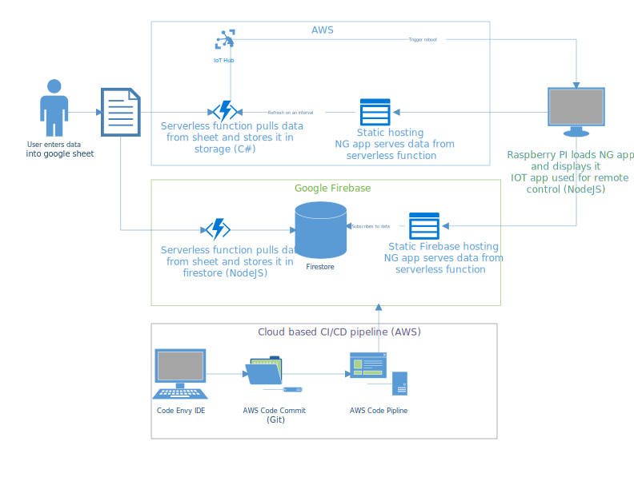

# Back story
 - USB stick that had to be manually removed to update
 - Data had to be emailed to support to be updated
 - Updates are needed multiple times a day

# Success Criteria
 - Quickly update without interrupting service
 - Easy, spreadsheet like data entry
 - Secure enough
 - Cheap / free to host
 - Low administrative overhead (I'm lazy)
 - Learn some new stuff




# Solution (v1)
> http://dbb-hosting.s3-website.us-east-2.amazonaws.com/
 - Angular UI
 - Data is retrieved via AWS Lambda (serverless)
 - Angular polls for updates
 - Google sheets as the data entry mechanism
 - Google authentication to protect the sheet
 - Raspberry PI connects to the flat screen and is controlled via AWS IoT
 - Big red button for remote reboots

> demo:  show v1 in devtools and edit a beer

> demo: look at AWS IoT

> demo: show code for angular and lambda


# Solution (v2)
> Mostly the same, but moved from polling to google firebase
http://dutchs.board.jesstedder.net
- Data is loaded into firebase via AWS Lamba whenever sheet changes
- UI subscribes to Google Firebase for real time updates
- AWS Route 53 configured to route traffic to V1 or V2 without needing access to the IoT device.
- AWS devops tools automate build and deploy of updates

> demo:  show v2 with devtools and edit a beer

> demo: show code for angular and firebase

> demo: show Route 53 and static hosting


# Result
 - Data entry happens via familiar interface (Google Sheets)
 - Using builtin auth mechanism of google provides security
 - Updates happen in real time
 - Static hosting, serverless functions, and firebase cost pennies per month
 - AWS IoT, Route 53, and devops usage result in only needing to touch the device on premise when the wifi password changes or it gets dropped in a beer.
 - New stuff learned:  AWS Lambda, NodeJS, AWS IoT, Raspberry Pi

# How I would do it with Azure
 > At the time there were no good options for serverless real time data and cheap hosting
 - Azure serverless SignalR
 - Azure static hosting
 - Azure functions with proxy support

# Lets write some code :fist:
> Go here:  https://github.com/jesstedder/demos-serverless

### Goal
This is a simulated report generator.  It will allow you to enter a number and name of a report and it will trigger a backend process that will create dummy PDFs.  The 
backend process will send updates to the UI so the user can see when the PDF creation has finished.

### Technologies 
- Angular for the UI
- Azure storage with static hosting for the UI 
- Azure functions to enqueue the requests
- Azure fuctions proxy to handle CORS issue
- Azure Queue storage for the queue itself
- Azure functions to consume queue and perform backend processing
- Azure signalr to send updates back to the UI

### Get the base project setup
``` bash 
git clone https://github.com/jesstedder/demos-serverless.git

cd demos-serverless

cd functions

dotnet restore

cp example.local.settings.json local.settings.json
# Edit the settings file and insert the storage account and signalr connection strings

cd ../report-gen-ui

npm install

ng serve

# in a second terminal
cd ../functions
func start
```
- Now go to http://localhost:7071
- Run some "reports" 
- Look at storage to see its really doing this thing
- Look at function code
- Look at dev tools
- look at proxies.json

### Add a new function
So now we'll add a super important feature, we'll add the ability to click a button and get the server time.

``` bash
cd functions
func new
#HttpTrigger
#GetServerTime
```

 Open the new file, modify it to look like this

``` c#
using System;
using System.IO;
using System.Threading.Tasks;
using Microsoft.AspNetCore.Mvc;
using Microsoft.Azure.WebJobs;
using Microsoft.Azure.WebJobs.Extensions.Http;
using Microsoft.AspNetCore.Http;
using Microsoft.Extensions.Logging;
using Newtonsoft.Json;

namespace functions
{
    public static class GetServerTime
    {
        [FunctionName("GetServerTime")]
        public static async Task<IActionResult> Run(
            [HttpTrigger(AuthorizationLevel.Anonymous, "get", "post", Route = null)] HttpRequest req,
            ILogger log)
        {
            var res = new Microsoft.AspNetCore.Mvc.JsonResult(new { now = DateTime.UtcNow });
            return res;

        }
    }
}

```
Now start the project 

```bash
func start
```
and then browse to http://localhost:7071/api/GetServerTime


Next lets add a new angular component to show the server time


```bash
cd ../report-gen-ui/
ng g component ServerTime
```


Add this code to report-generator.service.ts
```typescript
 getServerTime(){
    return this.http.get(`${environment.functionBaseUrl}/GetServerTime`);

  }
```

Edit server-time/server-time.component.ts to look like this
``` typescript
import { Component, OnInit } from '@angular/core';
import {ReportGeneratorService} from '../report-generator.service';

@Component({
  selector: 'app-server-time',
  templateUrl: './server-time.component.html',
  styleUrls: ['./server-time.component.css']
})
export class ServerTimeComponent implements OnInit {

  constructor(private rptGenSvc:ReportGeneratorService) { }

  serverTime:any = null;

  ngOnInit() {
  }

  serverTimeClick(){
    this.rptGenSvc.getServerTime().subscribe(st=>{
      this.serverTime = st;
    })
  }

}

```

The server-time-component.html should look like this:
``` html
<p>
  server-time is {{serverTime.now}}
  <button mat-raised-button color="primary" (click)="serverTimeClick()">Get the time</button>

</p>

```


Add this to app.component.html
``` html
<app-server-time></app-server-time>
```

Now run
``` bash
cd functions
func start
```

and 
``` bash
ng start
```

Browse to http://localhost:4200 to test

and now deploy


## Notes for me
Initialize the function app locally
```
#in the folder
func init

#create a new function
func new

#start the function app
func start


#clean out th published "reports"
az storage blob delete-batch --account-name demoserverlessstorage --source reports
```